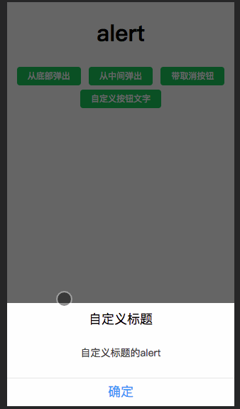
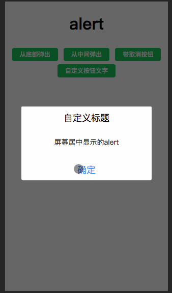
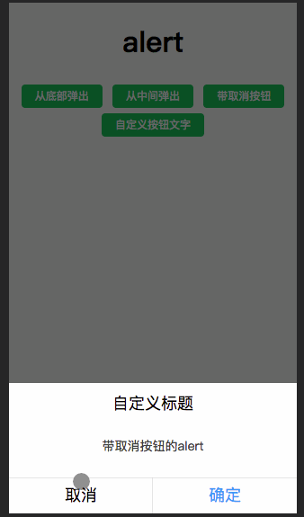
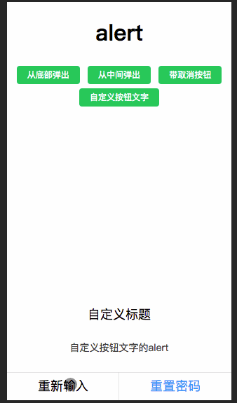

# alert 弹出提示组件

Author：[@dunizb](https://github.com/dunizb)

## screenshot
| 从底部弹出 | 从中间弹出  |
|:-------:|:------:|
|||
| 带取消按钮 | 自定义按钮文字  |
|||


## Install
引入`src`中的所有文件，导入主文件：`alert.vue`

## Usage

### Example
```html
<template>
  <div class="cl-div">
    <h1>alert</h1>
    <button @click="showBottom">从底部弹出</button>
    <cl-alert ref="clalert"></cl-alert>
  </div>
</template>

<script>
  import ClAlert from '@components/alert/alert'
  export default {
    components: { ClAlert },
    methods: {
      showBottom () {
        this.$refs.clalert.show({
          title: '自定义标题',
          content: '自定义标题的alert'
        })
      }
  }
</script>
```

### Methods
|方法名  |说明        |参数         |
|:------|:----------|:------------|
|show   |显示alert  |config (Object) |

### show 参数，参数为一个对象
|属性名    |说明         |类型      |是否必须|是否双向绑定|默认值|
|:--------|:-----------|:--------|:------|:-------|:-----|
|title    |自定义标题    |String   |否     |否      | 提示  |
|content  |内容         |String   |是     |否      | -  |
|cancel   |是否显示取消按钮 |Boolean  |否     |否  | false |
|cancelText |自定义取消按钮文字，cancel必须为true|String|否 |否|取消|
|successText |自定义确定按钮文字|String|否 |否|确定|
|direction |显示位置：`bottom`(从屏幕底部弹出)或`center`(从屏幕中间弹出)|String|否 |否|bottom|
|maskClose |是否能点击遮罩层关闭|Boolean|否 |否|false|
|onSuccess |点击确定后的回调|Function|否 |否|null|
|onCancel |点击取消后的回调|Function|否 |否|null|
