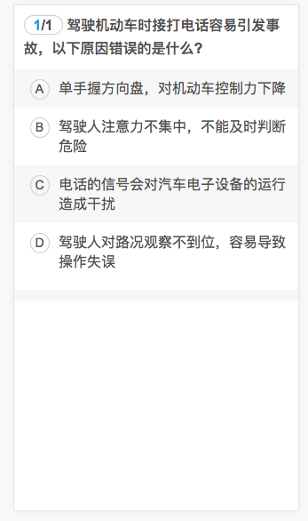
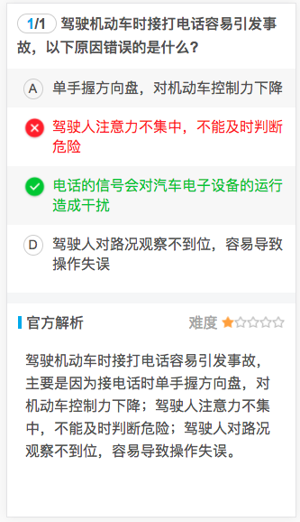

# Answer 答题组件

Author：[@dunizb](https://github.com/dunizb)

## screenshot
| 未答题时 | 答题  |
|:-------:|:------:|
|||

## Install
引入`src`中的所有文件，导入主文件：`answer.vue`

## Usage

### Example
```html
<template>
  <div class='cl-div'>
    <cl-answer :data="data" :total="total"></cl-answer>
  </div>
</template>

<script>
  import answer from '@components/answer/answer'
  export default {
    data () {
      return {
        total: 1,
        data: {
          question: '驾驶机动车时接打电话容易引发事故，以下原因错误的是什么?',
          options: {
            A: '单手握方向盘，对机动车控制力下降',
            B: '驾驶人注意力不集中，不能及时判断危险',
            C: '电话的信号会对汽车电子设备的运行造成干扰',
            D: '驾驶人对路况观察不到位，容易导致操作失误'
          },
          answer: 'C',
          type: '1',
          media: '',
          difficulty: '1',
          comments: '驾驶机动车时接打电话容易引发事故，主要是因为接电话时单手握方向盘，对机动车控制力下降；驾驶人注意力不集中，不能及时判断危险；驾驶人对路况观察不到位，容易导致操作失误。'
        }
      }
    },
    components: {
      'cl-answer': answer
    }
  }
</script>

<style scoped>
  @import '../../assets/css/common.css';
</style>
```

### Props
|属性名   |       说明    |  类型    |是否必须|是否双向绑定|默认值|
|:------|:--------------|:--------|:------|:-------|:-----|
|data   |数据            |Object   |是     |否      | -  |
|total  |总题目数         |Number   |否     |否      | 0  |
|zebra  |是否显示斑马线背景 |Boolean  |否     |否      | true |
|currentIndex |是否显示当前页和总页数|Boolean |否     |否    | true|

### Events
|事件名 |       说明      |  参数/返回值          |
|:------|:--------------|:--------------|
|change | 选择答题选项的时候触发 | answer：用户选择的选项，OKAnswer：正确的选项  |

### Methods
|方法名 |       说明    |
|:------|:--------------|
|resetData |重置数据状态 |
