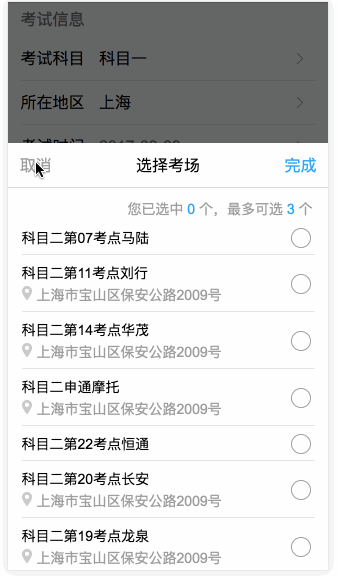

# Checklist 组件

Author：@dunizb

## screenshot


## Install
引入`src/checklist.vue`

## Usage

### Example
```html
<template>
  <div class="cl-div">
    <div class="center">
      <h1>checklist demo</h1>
      <input type="text" @focus="openChecklist" placeholder="请选择考场">
      <p v-for="(item, index) in kaochangVal">{{item.label}}</p>
    </div>

    <checklist ref="checklist"
               :data-list="data"
               :max="2" @on-change="changeKaochangValue"></checklist>
  </div>
</template>

<script>
  import checklist from '@components/checklist/checklist'
  export default {
    data () {
      return {
        data: [
          {
            label: '科目二第07考点马路',
            value: '101',
            address: '上海市宝山区宝安公路2009号'
          },
          {
            label: '科目二第08考点沪松公路',
            value: '102',
            address: '上海市闵行区沪松公路565弄128号'
          },
          {
            label: '科目二第09考点七宝',
            value: '103',
            address: '上海市闵行区沪松公路200号'
          },
          {
            label: '科目二第09考点世纪公园世纪公园',
            value: '104',
            address: ''
          },
          {
            label: '科目二第09考点世纪公园',
            value: '105',
            address: '上海市浦东新区世纪大道200号'
          },
          {
            label: '科目二第09考点哈哈哈哈',
            value: '107'
          },
          {
            label: '科目二第09考点合川路地铁站',
            value: '106',
            address: '上海市合川路地铁站2号出口'
          }
        ],
        kaochangVal: []
      }
    },
    methods: {
      openChecklist () {
        this.$refs['checklist'].show()
      },
      changeKaochangValue (val) {
        this.kaochangVal = val
      }
    },
    components: { checklist }
  }
</script>
```

### Props
|属性名|       说明      |  类型 |是否必须|是否双向绑定|默认值|
|:------|:--------------|:------|:------|:-------|:-----|
|max  |最多选择几项|Number  |是     |否       | 0   |
|dataList |数据        |Array |是     |否       | []   |
|checkboxLeft |选框是否在左边 |Boolean |否     |否       | false   |

### Events
|事件名 |       说明      |  参数/返回值          |
|:------|:--------------|:--------------|
|on-change |点击确定之后触发的事件|Object  |

### Methods
|方法名 |       说明    |
|:------|:--------------|
|show |显示组件|
|hide |隐藏组件|
