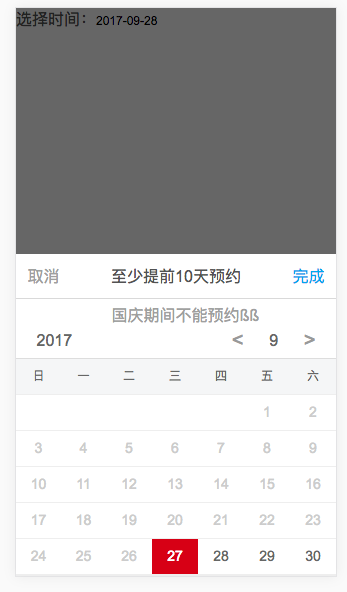

# datePicker 日期选择组件

Author：[@dunizb](https://github.com/dunizb)

## screenshot


## Demo
[demo.vue](demo.vue)

## Install
引入`src`中的所有文件，导入主文件：`cl-date-picker.vue`

## Usage

### Example
```html
<template>
  <div class="cl-div">
    选择时间：<input v-model="dateVal" readonly="readonly" @focus="openDatePicker" placeholder="请选择" type="text">

    <cl-date-picker ref="datepicker"
                    title="至少提前10天预约"
                    :forward="true"
                    :hasHeader="true"
                    @change="changeDatePicker">
      <p class="date-picker-desc">国庆期间不能预约ßß</p>
    </cl-date-picker>
  </div>
</template>

<script>
  import clDatePicker from '@components/datePicker/cl-date-picker'
  export default {
    data () {
      return {
        dateVal: ''
      }
    },
    methods: {
      openDatePicker () {
        this.$refs.datepicker.open()
      },
      changeDatePicker (value) {
        console.log(value)
        this.dateVal = value
      }
    },
    components: {
      clDatePicker
    }
  }
</script>
```

### Props
|属性名|       说明      |  类型 |是否必须|是否双向绑定|默认值|
|:------|:--------------|:------|:------|:-------|:-----|
|title  |组件标题头      |String  |否     |否       | -  |
|hasHeader  |是否显示组件头，header-toolbar|Boolean  |否 |否  | true  |
|format  |日期格式       |String  |否     |否       | yyyy-mm-dd  |
|forward |向前看（只能选择今天及以后）|Boolean |否     |否    | false|
|backward|时至今日（只能选择今天之前）|Boolean|否     |否     | false|
|noToday|今天不行（不能选今天）|Boolean|否     |否     | false|

### Events
|函数名 |       说明      |  参数          |
|:------|:--------------|:--------------|
|change |选择选项之后触发的事件| 选择的日期，如2017-09-09  |

### Methods
|方法名 |       说明    |
|:------|:--------------|
|open |显示组件|
|hide |隐藏组件|

### Slot
显示在组件头部