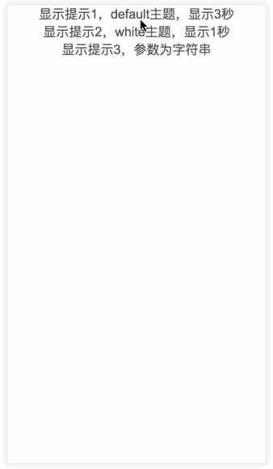

# message 消息提示组件

Author：[@dunizb](https://github.com/dunizb)

## screenshot


## Install
引入`message.vue`

## Usage

### Example
```html
<template>
  <div class="cl-div">
    <a href="javascript:;" @click="showMessage">显示提示</a>

    <message ref="message"></message>
  </div>
</template>

<script>
  import message from '@components/message/message'
  export default {
    components: { message },
    methods: {
      showMessage () {
        this.$refs.message.show({
          content: '谢谢参与',
          duration: 3
        })
      }
    }
  }
</script>

<style scoped>
  .cl-div{
    text-align: center;
  }
</style>
```

### Methods
|方法名    |       说明    |   参数 |
|:--------|:-------------|:----------|
|show     | 显示组件      |   config，见[可选参数](#可选参数)  |

### show方法可选参数
参数 config 可以是字符串或对象，当为字符串时，直接显示内容，当为对象时，具体说明如下：
| 属性     |       说明    |   类型   |   默认值   |
|:--------|:-------------|:----------|:---------|
|content  | 提示内容      |    String  | -  |
|duration |自动关闭的延时，单位秒，不关闭可以写 0| Number| 3|
|onClose  |关闭时的回调  |Function| - |
|themes|  主题，default：黑底白字，white：白底黑字| String | default|

