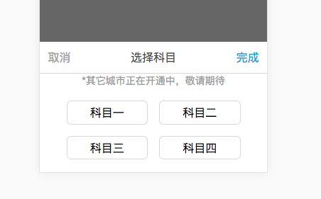

# select-modal 模态选择组件

Author：@dunizb

## screenshot


## Install
引入`src/select-modal.vue`

## Usage

### Example
```html
<template>
  <div class="cl-div">
    选择科目：<input v-model="subjectVal" readonly="readonly" @focus="openSubject" placeholder="请选择科目" type="text">

    <select-modal ref="clselect" title="选择科目" :data="subjectData" :multip="true" @change="getValue">
      <p slot="top" class="tip">*其它城市正在开通中，敬请期待</p>
      <p slot="bottom" class="tip">*其它城市正在开通中，敬请期待</p>
    </select-modal>
  </div>
</template>

<script>
  import selectModal from '@components/selectModal/select-modal'
  export default {
    data () {
      return {
        subjectVal: '',
        subjectData: [
          {
            value: 1,
            label: '科目一'
          },
          {
            value: 2,
            label: '科目二'
          },
          {
            value: 3,
            label: '科目三'
          },
          {
            value: 4,
            label: '科目四'
          }
        ]
      }
    },
    methods: {
      openSubject () {
        this.$refs.clselect.open()
      },
      getValue (obj) {
        console.log(obj)
        this.subjectVal = obj.label
      }
    },
    components: {
      selectModal
    }
  }
</script>

<style scoped>
  @import "../common/public.css";
  .tip{
    text-align: center;
    color: rgb(159,159,159);
  }
</style>
```

### Props
|属性名|       说明      |  类型 |是否必须|是否双向绑定|默认值|
|:------|:--------------|:------|:------|:-------|:-----|
|data  |select中的所有选项|Array  |是     |否       | -   |
|title |组件标题头        |String |否     |否       | -   |
|multip|是否支持多选      |Boolean|否     |否       | false|

### Events
|事件名 |       说明      |  参数/返回值          |
|:------|:--------------|:--------------|
|change |选择选项之后触发的事件|Object或Array，当props.multip = true时返回Array，否则返回Object  |

### Methods
|方法名 |       说明    |
|:------|:--------------|
|open |显示组件|
|hide |隐藏组件|

### Slot
|Slot |       说明    |
|:------|:--------------|
|top |显示在选项头部|
|bottom |显示在选项的尾部|
